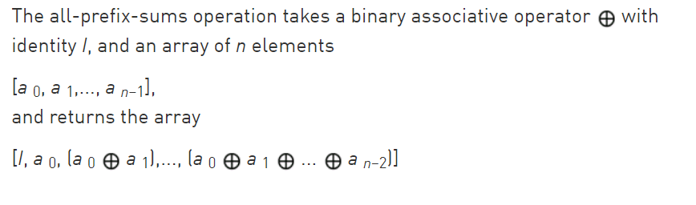
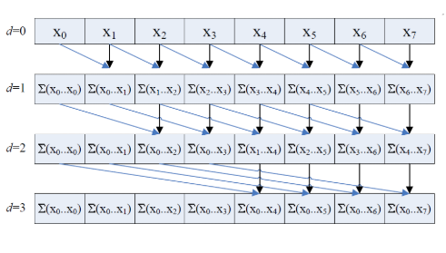
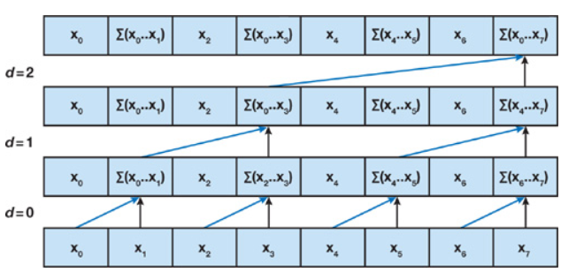
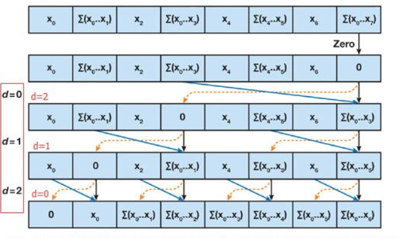
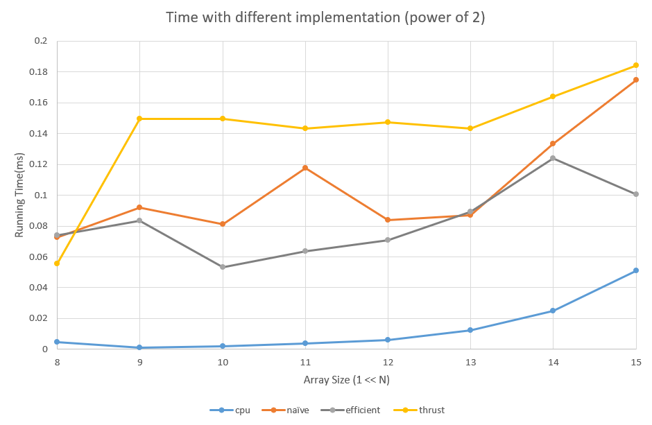
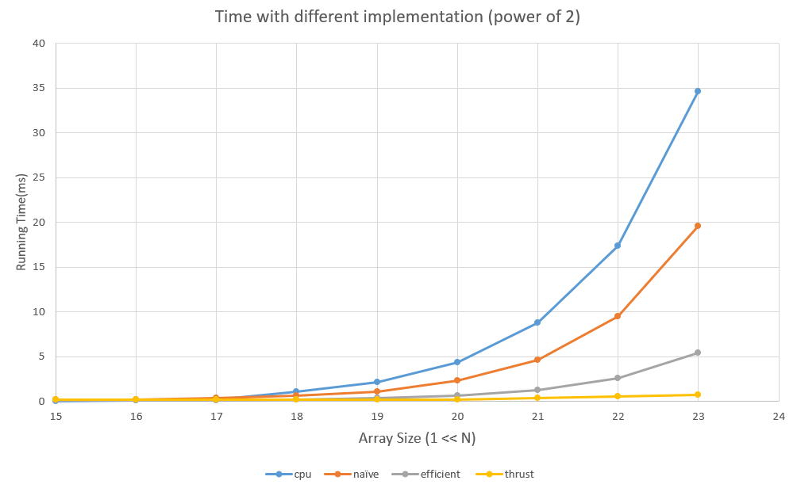
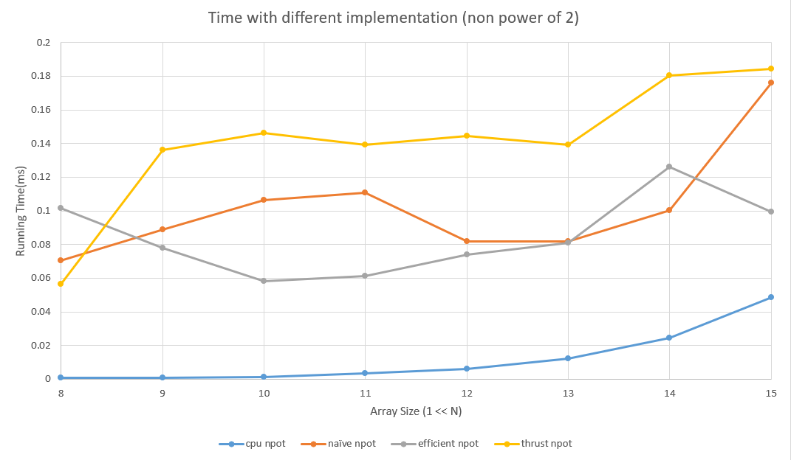
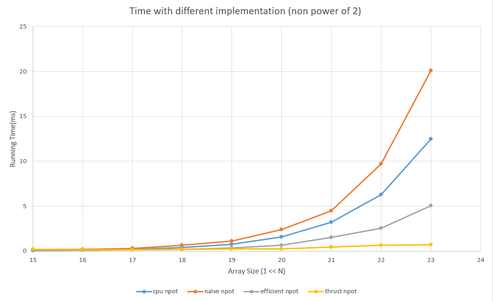

CUDA Stream Compaction
======================

**University of Pennsylvania, CIS 565: GPU Programming and Architecture, Project 2**

* Siyu Zheng
* Tested on: Windows 10, i7-8750 @ 2.20GHz 16GB, GTX 1060 6GB, Visual Studio 2015, CUDA 8.0(Personal Laptop)

## Description

### Stream Compation


The goal of stream compaction is that, given an array of elements, we create a new array with elements that meet a certain criteria, e.g. non null and preserve order. It's used in path tracing, collision detection, sparse matrix compression, etc.

* Step 1:  Compute temporary array
* Step 2:  Run exclusive scan on temporary array
* Step 3:  Scatter

### CPU Scan
Use for loop to compute an exclusive prefix sum. 


Number of add: O(n)

### Naive GPU Scan



Use double-buffer to scan two array. First do exclusive scan, then do shift right to get inclusive scan array.

Number of add: O(nlog2(n))

### Work-Efficient GPU Scan
Up-Sweep (Reduce) Phase:



 In the reduce phase, we traverse the tree from leaves to root computing partial sums at internal nodes of the tree.

Down-Sweep Phase:



In the down-sweep phase, we traverse back down the tree from the root, using the partial sums from the reduce phase to build the scan in place on the array. We start by inserting zero at the root of the tree, and on each step, each node at the current level passes its own value to its left child, and the sum of its value and the former value of its left child to its right child.

### Thrust's Implementation

Wraps a call to the Thrust library function thrust::exclusive_scan(first, last, result).

## Performance Analysis

* Roughly optimize the block sizes of each of your implementations for minimal run time on your GPU.
Array Size 1<<15 


| Block Size    | 128           |  256     | 512     |1024    |
| ------------- |-------------|-------| -----|----- |
| naive         | 0.16784       | 0.132096 | 0.157504|0.155584 |
| coherent      | 1639.7        |   1534.2 | 0.094048| 0.096736 |

In my experiment, the performance for different block size is quite closed. I chose 1024 for my further tests.


* Compare all of these GPU Scan implementations (Naive, Work-Efficient, and Thrust) to the serial CPU version of Scan. Plot a graph of the comparison (with array size on the independent axis).





* Write a brief explanation of the phenomena you see here.

At first, I used non-optimized efficient GPU scan which is slower than CPU approach. Then I optimized it with resizable blockPerGrid, so that in each level of depth in scanning we can terminate idle threads. In upSweep and downSweep stage, modify the array index to maintain correctness. As a result, in test of array size larger than 16, the effiecient GPU approach has better performance than CPU approach.

Compare these four implementation, we can see that when the array size is small, the CPU approach has the best performance. Effiecient GPU approach is better than naive approach. After array size larger than 16, GPU implementation has better performance than CPU. For thrust approach, when array size is large, it has the best performance and the as the size grows, the running time doesn't increase much so it's quite stable.

I checked timeline when array size is 1 << 15. The function call of thrust::exclusive_scan is about one half of each kernel sweep call. So in the thrust implementation most expense is on memory allocation and copy. I guess the base cost for memory operation is quite big in thrust, but as the array size grows, since it might has some kind of memory access optimization like contiguous memory access, the memory operation cost might not increase a lot. As a result, in larger array, thrust implementation has the best performance.

The performance bottleneck for naive approach is mainly the algorithm. For non-optimized efficient scan, too many idle threads is the bottleneck. For optimized efficient GPU approach, the bottleneck is mainly memory I/O. If we switch to shared memory, the performance will increase a lot. 

## Result

Array size = 1<<15

```

****************
** SCAN TESTS **
****************
    [  10  39  41   0  14  37  18  40   1  42  27  21  10 ...  14   0 ]
==== cpu scan, power-of-two ====
   elapsed time: 0.10945ms    (std::chrono Measured)
    [   0  10  49  90  90 104 141 159 199 200 242 269 290 ... 803563 803577 ]
==== cpu scan, non-power-of-two ====
   elapsed time: 0.116406ms    (std::chrono Measured)
    [   0  10  49  90  90 104 141 159 199 200 242 269 290 ... 803493 803514 ]
    passed
==== naive scan, power-of-two ====
   elapsed time: 0.235072ms    (CUDA Measured)
    passed
==== naive scan, non-power-of-two ====
   elapsed time: 0.197024ms    (CUDA Measured)
    passed
==== work-efficient scan, power-of-two ====
   elapsed time: 0.147424ms    (CUDA Measured)
    passed
==== work-efficient scan, non-power-of-two ====
   elapsed time: 0.119808ms    (CUDA Measured)
    passed
==== thrust scan, power-of-two ====
   elapsed time: 0.299008ms    (CUDA Measured)
    passed
==== thrust scan, non-power-of-two ====
   elapsed time: 0.253952ms    (CUDA Measured)
    passed

*****************************
** STREAM COMPACTION TESTS **
*****************************
    [   0   3   0   2   1   3   2   3   3   1   3   0   0 ...   1   0 ]
==== cpu compact without scan, power-of-two ====
   elapsed time: 0.121971ms    (std::chrono Measured)
    [   3   2   1   3   2   3   3   1   3   2   1   2   1 ...   2   1 ]
    passed
==== cpu compact without scan, non-power-of-two ====
   elapsed time: 0.139594ms    (std::chrono Measured)
    [   3   2   1   3   2   3   3   1   3   2   1   2   1 ...   1   1 ]
    passed
==== cpu compact with scan ====
   elapsed time: 0.552812ms    (std::chrono Measured)
    [   3   2   1   3   2   3   3   1   3   2   1   2   1 ...   2   1 ]
    passed
==== work-efficient compact, power-of-two ====
   elapsed time: 0.141568ms    (CUDA Measured)
    passed
==== work-efficient compact, non-power-of-two ====
   elapsed time: 0.243712ms    (CUDA Measured)
    passed

```
