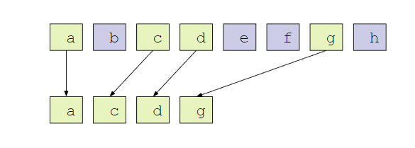

CUDA Stream Compaction
======================

**University of Pennsylvania, CIS 565: GPU Programming and Architecture, Project 2**

* Siyu Zheng
* Tested on: Windows 10, i7-8750 @ 2.20GHz 16GB, GTX 1060 6GB, Visual Studio 2015, CUDA 8.0(Personal Laptop)

## Description

### Stream Compation


The goal of stream compaction is that, given an array of elements, we create a new array with elements that meet a certain criteria, e.g. non null and preserve order. It's used in path tracing, collision detection, sparse matrix compression, etc.

* Step 1:  Compute temporary array
* Step 2:  Run exclusive scan on temporary array
* Step 3:  Scatter

### CPU Scan

### Naive GPU Scan

### Work-Efficient GPU Scan

### Thrust's Implementation


## Performance Analysis

* Roughly optimize the block sizes of each of your implementations for minimal run time on your GPU.
Array Size 1<<15 


| Block Size    | 128           |  256     | 512     |1024    |
| ------------- |:-------------:|：-------:| ：-----:|：-----: |
| naive         | 0.16784       | 0.132096 | 0.157504|0.155584 |
| coherent      | 1639.7        |   1534.2 | 0.094048| 0.096736 |


* Compare all of these GPU Scan implementations (Naive, Work-Efficient, and Thrust) to the serial CPU version of Scan. Plot a graph of the comparison (with array size on the independent axis).

* Write a brief explanation of the phenomena you see here.

* 

## Result

```

****************
** SCAN TESTS **
****************
    [  10  39  41   0  14  37  18  40   1  42  27  21  10 ...  14   0 ]
==== cpu scan, power-of-two ====
   elapsed time: 0.10945ms    (std::chrono Measured)
    [   0  10  49  90  90 104 141 159 199 200 242 269 290 ... 803563 803577 ]
==== cpu scan, non-power-of-two ====
   elapsed time: 0.116406ms    (std::chrono Measured)
    [   0  10  49  90  90 104 141 159 199 200 242 269 290 ... 803493 803514 ]
    passed
==== naive scan, power-of-two ====
   elapsed time: 0.235072ms    (CUDA Measured)
    passed
==== naive scan, non-power-of-two ====
   elapsed time: 0.197024ms    (CUDA Measured)
    passed
==== work-efficient scan, power-of-two ====
   elapsed time: 0.147424ms    (CUDA Measured)
    passed
==== work-efficient scan, non-power-of-two ====
   elapsed time: 0.119808ms    (CUDA Measured)
    passed
==== thrust scan, power-of-two ====
   elapsed time: 0.299008ms    (CUDA Measured)
    passed
==== thrust scan, non-power-of-two ====
   elapsed time: 0.253952ms    (CUDA Measured)
    passed

*****************************
** STREAM COMPACTION TESTS **
*****************************
    [   0   3   0   2   1   3   2   3   3   1   3   0   0 ...   1   0 ]
==== cpu compact without scan, power-of-two ====
   elapsed time: 0.121971ms    (std::chrono Measured)
    [   3   2   1   3   2   3   3   1   3   2   1   2   1 ...   2   1 ]
    passed
==== cpu compact without scan, non-power-of-two ====
   elapsed time: 0.139594ms    (std::chrono Measured)
    [   3   2   1   3   2   3   3   1   3   2   1   2   1 ...   1   1 ]
    passed
==== cpu compact with scan ====
   elapsed time: 0.552812ms    (std::chrono Measured)
    [   3   2   1   3   2   3   3   1   3   2   1   2   1 ...   2   1 ]
    passed
==== work-efficient compact, power-of-two ====
   elapsed time: 0.141568ms    (CUDA Measured)
    passed
==== work-efficient compact, non-power-of-two ====
   elapsed time: 0.243712ms    (CUDA Measured)
    passed

```
